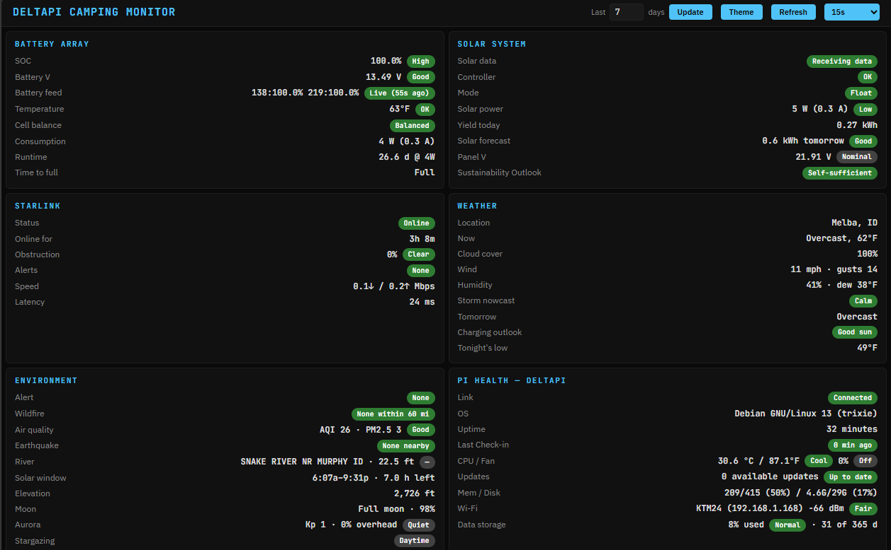
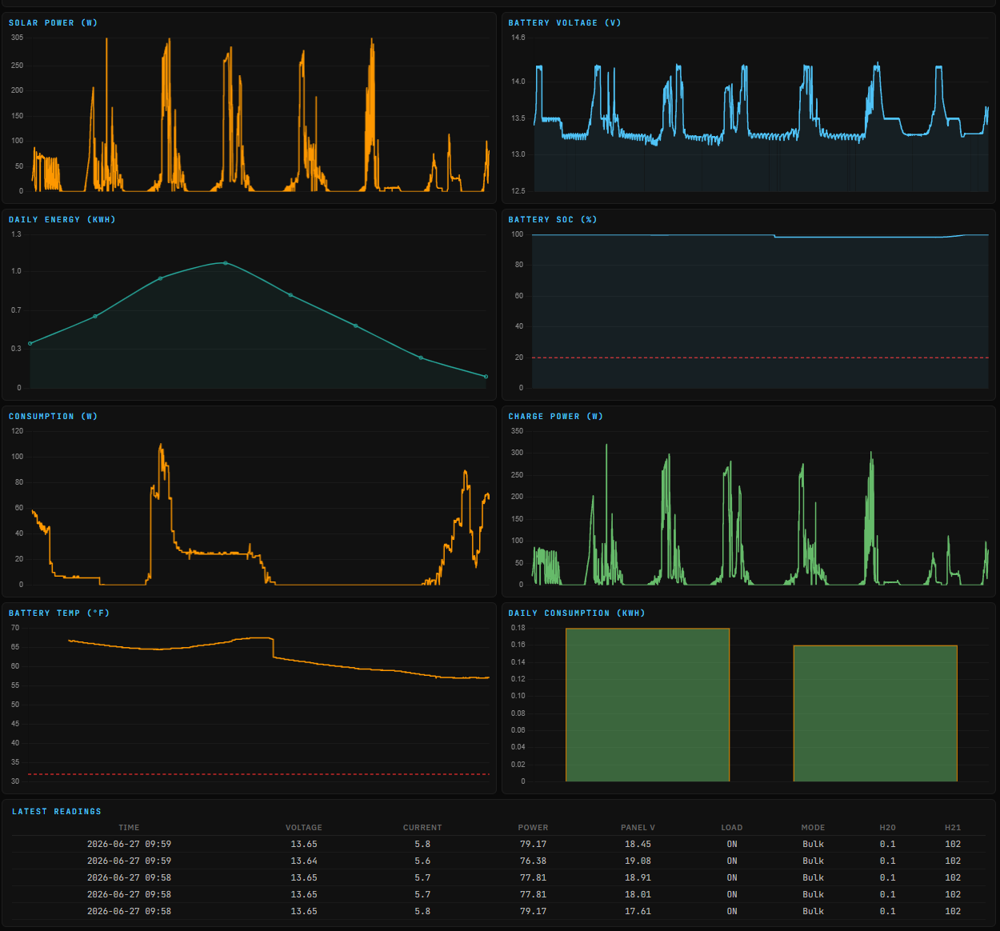

# DeltaPI — Off-Grid Camp Monitor




DeltaPI started as a Victron solar monitor and grew into a single-screen **camp
systems dashboard** for an off-grid RV: **power, connectivity, and weather** at a
glance. A Raspberry Pi in the rig gathers data from several sources and bulk-uploads
to a small Flask app on Render.com, which renders a fast, mobile-friendly dashboard.

## Data sources

| Source | How | Provides |
|---|---|---|
| **Victron MPPT** (SmartSolar) | VE.Direct over USB serial | Solar power, panel voltage, charge current, charge mode, daily/lifetime yield, controller errors |
| **Renogy Pro batteries** (`RBT12100LFP-BT`) | Bluetooth LE (BMS) | True coulomb-counted SOC, current, voltage, temperature, per-cell voltages |
| **Starlink dish** (round + Mini) | local gRPC API (`192.168.100.1:9200`) | Connection status, obstruction %, alerts, throughput, latency, GPS location |
| **Open-Meteo** | server-side HTTP (free, no key) | Current conditions, cloud cover, solar-radiation forecast, sunrise/sunset, air quality (US AQI + PM2.5) |
| **NWS** (`api.weather.gov`) | server-side HTTP (free, US only) | Active severe-weather watches/warnings for the current location |

The MPPT only measures *charge* current, never house load — so consumption and
runtime are derived from the **batteries' measured net current** (see
[Runtime & consumption](#runtime--consumption)).

## Dashboard

Six info panels (an even 3×2 grid), eight charts, and a readings table. Status pills are consistent:
**green = good, yellow = warning, red = problem, gray = informational/idle** (except
solar production, which has no "bad" state — green = producing, gray = off).

- **Battery Array** (measured over BLE): SOC, battery voltage, per-battery feed-health
  pill, temperature (with a LiFePO4 cold-charge warning), cell balance, consumption
  (W and A), runtime, time-to-full.
- **Solar System**: data freshness, controller health (VE.Direct `ERR`), charge mode
  (Bulk/Absorption/Float), solar power (W and A), yield today, panel voltage, and a
  **Sustainability Outlook** — Self-sufficient / Sustaining / Drawing down ~N days /
  Critical — fusing measured daily harvest vs. consumption with the solar forecast
  (see [Runtime & consumption](#runtime--consumption)).
- **Starlink**: connection status, obstruction %, alerts (mast-not-vertical, thermal,
  roaming, water…), throughput, latency.
- **Weather**: current conditions, cloud cover, tomorrow's charging outlook, freeze
  warning. Located from the dish's GPS, or a configured home fallback.
- **Environment**: severe-weather alert (NWS watches/warnings — storm/wind/flood/fire),
  air quality (US AQI + PM2.5 as a wildfire-smoke proxy), wind + gusts, humidity + dew
  point (with a condensation-risk flag), tonight's low, today's solar window
  (sunrise–sunset + hours of sun left), site elevation, and moon phase + illumination.
- **Pi Health**: serial link, OS, uptime, last check-in, CPU/fan, updates, mem/disk,
  Wi-Fi, container disk.
- **Charts** (Chart.js): Solar Power, Battery Voltage, Daily Energy (kWh), Battery SOC
  (with a red danger floor), Consumption, Charge Power, Battery Temp (with a freezing
  line), Daily Consumption.
- Latest-readings table, light/dark theme (cookie-persisted), auto-refresh, and a
  responsive layout that stacks to one scrolling column on a phone.

## Repo layout

The two deployables live in their own top-level directories: `server/` (the
Render web app) and `pi/` (the field agent). `render.yaml` and this README stay at
the root.

**`server/` — Flask app on Render**

| Path | Purpose |
|---|---|
| `app.py` | Flask entry point: ingestion routes (`/log`, `/log/bulk`, `/status`), `/encrypt_days`, and the dashboard routes (`/` shell, `/panels`, `/external`) |
| `config.py` | Env-derived settings and static lookup tables (VE.Direct/WMO/AQI/flood maps) |
| `util.py` | Cross-cutting helpers: logging, formatters, token decryption, geo + moon math |
| `db.py` | SQLite schema, per-request connections, and throttled retention cleanup |
| `integrations.py` | Failure-tolerant external providers (weather, AQI, NWS, fire, quake, aurora, river, geocode) with a two-tier cache (memory + SQLite, survives deploys) and a view-gated background refresher |
| `energy.py` | Battery/solar model: SOC estimate, runtime, sustainability outlook, empirical load |
| `dashboard.py` | Builds the template context from log rows + Pi status (DB stage) and the deferred weather/environment fragments (external stage) |
| `templates/index.html`, `templates/panels.html`, `static/style.css`, `static/dashboard.js` | Dashboard shell + panels fragment, styles, and the progressive-load / Chart.js wiring |
| `requirements.txt` | Server Python dependencies |

**`pi/` — field agent on the Raspberry Pi**

| Path | Purpose |
|---|---|
| `vedirect_logger.py` | (systemd `vedirect_logger`) Read VE.Direct serial, buffer/upload, post Pi health, control the cooling fan, merge battery + Starlink state into uploads |
| `renogy_ble.py` | (systemd `renogy_ble`) Poll the batteries over BLE → `battery_state.json` |
| `starlink_poll.py` | (systemd `starlink_poll`) Poll the Starlink dish over gRPC → `starlink_state.json` |
| `renogybt/` | Vendored, trimmed + patched [`cyrils/renogy-bt`](https://github.com/cyrils/renogy-bt) (battery path only; fixes the Pro batteries' duplicate-GATT-UUID notify bug) |
| `deploy.py` | One-command installer: renders the unit/logrotate templates for this machine and (re)starts the services |
| `deploy/` | systemd unit + log-rotation templates and Pi-only requirement lists |

## Architecture

Three independent pollers on the Pi each write a small JSON state file; the logger
merges them and uploads. Decoupling means a Bluetooth or Starlink hiccup never
affects serial logging or uploads.

- **Pi → server**: bulk upload to `/log/bulk` every `UPLOAD_INTERVAL` (30 s). Uploads
  are chunked under the server's 1 MB limit so a backlog drains across requests
  instead of failing as one oversized POST.
- **Merged feeds**: each uploaded frame carries the latest `battery` and `starlink`
  snapshots (with their own timestamps), so the dashboard can show whether each feed
  is live, stale, or down rather than trusting old numbers.
- **Local buffering / archive**: frames are written to JSONL with byte-offset
  tracking (survives outages) and archived 14 days on the SD card (pruned at most
  once a day to limit wear).
- **Backfill**: if the server DB is ever empty, the Pi replays its archive.
- **Persistent server DB**: SQLite on a Render Disk at `/data`; 365 days of solar logs,
  7 days of Pi status, pruned daily.

## Runtime & consumption

The MPPT can't see house load, so:

1. **Measured (preferred)** — with a live BLE feed, **house load = MPPT output power −
   battery net power** (valid charging or discharging), and SOC is the batteries' true
   coulomb count. Runtime = usable charge (down to a ~10% floor) ÷ measured load.
2. **Estimated (fallback)** — if the battery feed is offline, an energy balance over a
   trailing 72 h window (lifetime yield `H19` minus voltage-based stored-energy change),
   shown labeled `(est)`. Measured last-known values are preferred over this when
   available, so the blunt estimate rarely appears.

`Runtime` is deliberately a *battery-only, "if the sun vanished now"* figure. For the
question that actually matters off-grid — **am I in surplus or deficit going forward?**
— the Solar panel's **Sustainability Outlook** fuses three horizons: *now* (is the
battery charging?), *multi-day* (measured daily harvest vs. consumption → a buffer in
**days**, not hours, when in deficit), and the *solar forecast* — today's remaining
sun (radiation × daylight left) **or** tomorrow's (can the sun keep up?).
States: **Self-sufficient** (building/holding surplus), **Sustaining** (break-even),
**Drawing down ~N days** (deficit; annotated *recovering* when the forecast turns it
around), and **Critical** (low SOC with no sun coming). It shows **Gathering data**
until there's enough daily history to judge.

## Environment variables

| Variable | Where | Required | Purpose |
|---|---|---|---|
| `POST_SECRET` | Server + Pi | Yes | Bearer token authenticating POST requests |
| `FERNET_KEY` | Server | Yes | Fernet key for date-range tokens |
| `BASE_URL` | Pi | Yes | Server URL the logger uploads to |
| `DB_DIR` | Server | No | DB/log dir (default `/data`) |
| `HOME_LAT` / `HOME_LON` | Server | No | Home weather location (decimal degrees) used when the dish isn't sharing GPS. Kept out of the repo for privacy. |
| `HOME_DISH_ID` | Server | No | Home dish id; weather hides rather than showing home coords when roaming on a different, no-GPS dish |

`POST_SECRET` and `FERNET_KEY` are validated at startup; the Pi exits if `POST_SECRET`
or `BASE_URL` is missing.

## Pi setup

Assumes a clean Raspberry Pi OS. `pi/deploy.py` detects the invoking user and repo
path — nothing is hard-coded to a particular username or home directory.

**1. System + serial + code**
```bash
sudo apt update && sudo apt install -y python3-venv python3-rpi.gpio git
sudo mkdir -p /var/log/vedirect && sudo chown $USER:$USER /var/log/vedirect
sudo usermod -aG dialout $USER          # serial access; re-login after
ls /dev/ttyUSB*                          # confirm /dev/ttyUSB0 (the MPPT)
git clone https://github.com/techdog21/deltapi.git ~/deltapi
pip3 install pyserial requests           # core-logger deps (system python3)
```

**2. Poller venv** — the BLE + Starlink pollers run in a venv (kept off the Render
server). `deploy.py` looks for it at `~/deltapi-venv` by default.
```bash
python3 -m venv ~/deltapi-venv
~/deltapi-venv/bin/pip install -r ~/deltapi/pi/deploy/requirements-ble.txt
~/deltapi-venv/bin/pip install -r ~/deltapi/pi/deploy/requirements-starlink.txt
sudo systemctl enable --now bluetooth
# edit the battery MACs/aliases at the top of pi/renogy_ble.py
# (optional) Starlink location/throughput needs the grpc tools:
git clone https://github.com/sparky8512/starlink-grpc-tools ~/starlink-grpc-tools
```

**3. Install the services** — one command renders the systemd units + logrotate for
this machine, then enables and starts them:
```bash
sudo python3 ~/deltapi/pi/deploy.py            # or: --dry-run to preview
```
On first run it writes a template `/etc/deltapi.env` (mode 600). Fill in the logger
secrets and restart it:
```bash
sudo nano /etc/deltapi.env                      # set POST_SECRET and BASE_URL
sudo systemctl restart vedirect_logger
```
Within ~30 s, `tail -f /var/log/vedirect/vedirect_error.log` should show
`[Serial] Connected`, `[Status] POST succeeded`, `[Upload] Bulk POST succeeded`.

**Location → weather** also needs the "Starlink location" / "Allow access on local
network" setting enabled in the Starlink app (the Mini exposes it; the older round
dish may not — use `HOME_LAT/LON` there).

**Redeploy after a code change** — pull and re-run the installer; it refreshes the
units and restarts the services:
```bash
cd ~/deltapi && git pull && sudo python3 pi/deploy.py
```
`deploy.py` takes optional service names (`vedirect_logger`, `renogy_ble`,
`starlink_poll`, `logrotate`) to act on just one, plus `--dry-run` and `--no-restart`.

## Server (Render)

Deploy via Blueprint: **New → Blueprint** in Render, point it at this repo, and
`render.yaml` provisions the web service, the 1 GB Disk at `/data`, and the build/
start commands. You'll be prompted for `POST_SECRET` and `FERNET_KEY` (kept out of
the repo via `sync: false`); optional vars from the table above can be added too.

- Build: `pip install -r server/requirements.txt` · Start: `gunicorn --chdir server app:app --bind 0.0.0.0:$PORT --threads 4`
  (the threads matter: the dashboard loads progressively, so `/panels`, `/external`, and Pi uploads overlap — if the Render dashboard overrides the start command, update it there too)
- Local dev: `cd server && POST_SECRET=x FERNET_KEY=$(...) python app.py`

## Routes

| Route | Method | Rate limit | Description |
|---|---|---|---|
| `/` | GET | — | Dashboard shell (instant; placeholders only) |
| `/panels` | GET | — | Dashboard panels fragment (local DB data; cached per date range) |
| `/external` | GET | — | Weather/Environment fragments (the eight third-party API lookups) |
| `/log` | POST | 3/min | Single solar entry |
| `/log/bulk` | POST | 5/min | Bulk entries (primary ingestion) |
| `/status` | POST | 2/min | Pi health + merged feeds |
| `/encrypt_days` | GET | 10/min | Encrypted date-range token |

## Security

Bearer-token auth (constant-time) on all POSTs, HTTPS enforced, Flask-Limiter rate
limits, 1 MB body cap (→ `413`), input validation, HTML escaping of all device-reported
fields, Fernet-encrypted date tokens, thread-safe DB cleanup, and no secrets in the repo.

## Fan control (Pi)

PWM fan on GPIO 18 by CPU temp: off below 30 °C, linear 20→100 % from 30→50 °C, full
above 50 °C; holds last speed if the temperature can't be read.

## License

MIT — see [LICENSE](LICENSE).

## Author

DeltaPI Project — Jerry Craft
